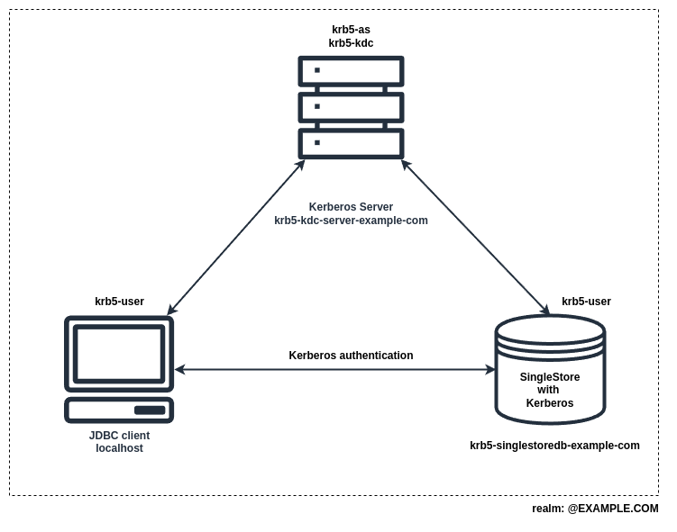

# README - Kerberos/SingleStore/Docker

Kerberos/SingleStore/Docker is a project that allows for the quick setup and testing of SingleStoreDB configured with Kerberos server.

The configuration of the Kerberos server has been simplified and is based on an example from [kerberos-docker](https://github.com/criteo/kerberos-docker)

## Prerequisites

Use an **operating system compatible with docker**, and install:  
- **docker-ce** (without `sudo` for running the docker command and with `overlay2` driver).  
- **docker-compose**
- **GNU Make** (if not already available).  
- **GNU Bash** (if not already available).
- **Python 3** (if not already available, with `pip` and `venv`).
- **Java 8 and Maven 3** (if not already available).  

## SingleStore license
Create the **SINGLESTORE_LICENSE** environment variable with the license key required to start the SingleStoreDB Docker container.

## Usage

After installation, there are 2 containers to check if it turns:

- `krb5-kdc-server-example-com` (Kerberos Server)
- `krb5-singlestoredb-example-com` (SingleStore DB)

The goal is to connect from `localhost` to `krb5-singlestoredb-example-com` with SingleStore JDBC client and Kerberos authentication.

  

## Installation

Execute:

~~~
make install
~~~

See `Makefile` with `make usage` for all commands.

## Testing

* To test Kerberos authentication using the SingleStore JDBC driver, navigate to `/src/main/java/com/singlestore/GssClientJdbc.java` and run the program. 
If everything is set up correctly, it should successfully log in with the `singlestore` user.

* To test Kerberos authentication using the SingleStore client use this [instructions](https://docs.singlestore.com/db/v8.7/security/authentication/kerberos-authentication/configuring-singlestore-for-kerberos-authentication/#connecting-to-singlestore-as-a-kerberos-authenticated-user)

## Uninstallation

Execute:

~~~
make clean
~~~

For Ubuntu operating system on the docker container:

To delete `minimal-ubuntu:latest` docker images do `docker rmi minimal-ubuntu`.

## Debug and see traces

You can connect with an interactive session to a docker container:

~~~
docker exec -it <container_name_or_id> bash
~~~

To debug Kerberos server:

~~~
export KRB5_TRACE=/dev/stdout
~~~

## Troubleshooting

**Kerberos services**

On `krb5-kdc-server-example-com` docker container, there are 2 Kerberos services `krb5-admin-service` and `krb5-kdc`:

~~~
supervisorctl status
~~~

See all opened ports on a machine:

~~~
netstat -tulpn
~~~

Check that each machine has a synchronized time (with `ntp` protocol and `date` to check).

See [Troubleshooting](https://web.mit.edu/kerberos/krb5-latest/doc/admin/troubleshoot.html) and
[Kerberos reserved ports](https://web.mit.edu/kerberos/krb5-1.5/krb5-1.5.4/doc/krb5-admin/Configuring-Your-Firewall-to-Work-With-Kerberos-V5.html).

**Conflict private IP addresses**

To create `example.com` network docker, the private sub-network `10.5.0.0/24`
should be free and private IP addresses `10.5.0.0/24` should be free also. Check
your routing table with `route -n`, test free IP addresses with
`ping -c 1 -w 2 <host>`, and check request paths with `traceroute <host>`.

If the issue persists, you can do `make clean` or `docker network rm example.com`.

**Working on your computer (host machine) for debugging code**

Modify your `/etc/hosts` to resolve bidirectionally IP addresses with DNS of
the Kerberos cluster:

~~~
# /etc/hosts
# ...

# Kerberos cluster
# IP FQDN hostname
10.5.0.2	krb5-kdc-server-example-com.example.com krb5-kdc-server-example-com
10.5.0.3	krb5-singlestoredb-example-com.example.com krb5-singlestoredb-example-com

# ...
~~~

You can `ping krb5-kdc-server-example-com|10.5.0.2` Kerberos KDC server, and check if
Kerberos server port is opened: `nmap -A 10.5.0.2/32 -p 88`.

Now you can debug code and do `kinit singlestore` on the host machine directly.

The order of `entries` and `names` is important in `/etc/hosts`.
To resolve name from an IP address, the resolver takes the first one (horizontally) if multiple names
are possible; and to resolve IP address from the name , the resolver takes the first entry (vertically)
if multiple IP addresses are possible: You can use `resolveip <IP|name>`, `getent hosts <IP|name>`
or just take a look at `/etc/hosts`.

## References

* ROBINSON Trevor (eztenia). **Kerberos**. Canonical Ltd. Ubuntu Article, November 2014. Link: https://help.ubuntu.com/community/Kerberos.
* MIGEON Jean. **Protocol, Installation and Single Sign On, The MIT Kerberos Admnistrator's how-to Guide**. MIT Kerberos Consortium, July 2008. p 62.
* BARRETT Daniel, SILVERMAN Richard, BYRNES Robert. **SSH, The Secure Shell: The Definitive Guide, 2nd Edition**. O'Reilly Media, June 2009. p. 672. Notes: Chapter 11. ISBN-10: 0596008953, ISBN-13: 978-0596008956
* GARMAN, Jason. **Kerberos: The Definitive Guide, 2nd Edition**. O'Reilly Media, March 2010. p. 272.  ISBN-10: 0596004036, ISBN-13: 978-0596004033.
* O’MALLEY Owen, ZHANG Kan, RADIA Sanjay, MARTI Ram, and HARRELL Christopher. **Hadoop Security Design**. Yahoo! Research Paper, October 2009. p 19.
*  MATTHIAS Karl, KANE Sean. **Docker: Up & Running**. O'Reilly Media, June 2015. p. 232. ISBN-10: 1491917571, ISBN-13: 978-1491917572.
